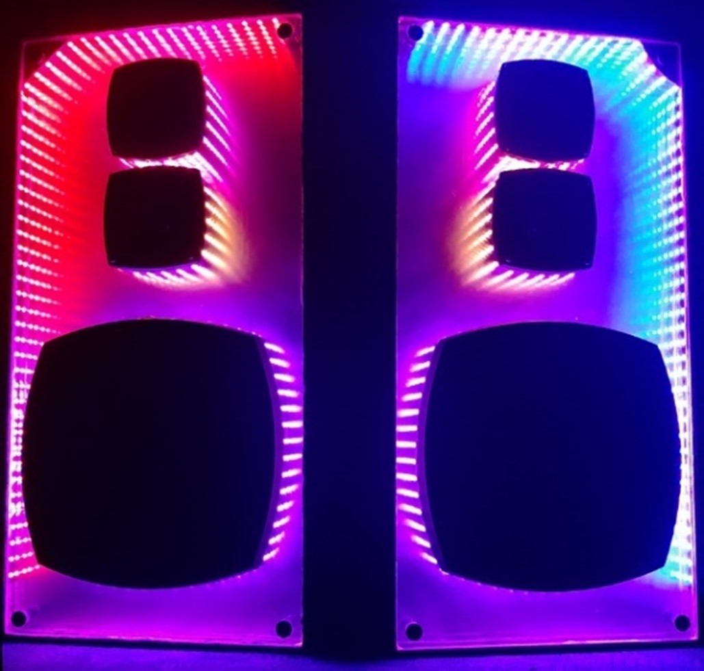

# Audiovizuális hangszóró

## Bevezetés
Ez egy olyan Bluetooth-os vevőegység, amire Bluetooth-os hangszóróként lehet rácsatlakozni, és így a hangot továbbítani rá. A vevőegységre nem direktbe van hangszóró kötve, csak egy vonali kimenetet ad, amit egy erősítő bemenetére lehet kötni.

Audiovizuális részeként, pedig címezhető RGB LED szalagokat lehet rákötni. A LED szalagokon megjelenő fényjáték konfigurálható, amit a sugárzott WiFi hotspot-on keresztül lehet beállítani tetszés szerint. Olyan beállítási lehetőségek is elérhetőek itt, amitől a fényjáték a hangra reagálva fog generálódni. A fogadott hangon folyamatosan futtatott analízis segítségével történik ez meg.

Kivitelezése a valóságban (egy régi Videoton hangfalpárt felhasználva)

## Rendszer felépítése

### Hardware

ESP32 devkit a rendszer alapja. Az ESP32 egy Espressif gyártmányú 2 magos Harvard architektúrájú Xtensa LX6 CPU. Ehhez van még hozzákötve a saját otthoni készítésű áramkör, amin a vonali kimenet, továbbá LED szalag kimenetek foglalnak helyet.

### Környezet

Az Espressif által biztosított ESP-IDF framework a környezet alapja, amiben a perifériák használatához rendelkezésre állnak függvények, az alacsony szintű perifériákhoz tartozó regiszter kezelések el vannak benne készítve. Absztrakt réteggel elválasztott alkalmazás réteg így jól elkülöníthető.

FreeRTOS beágyazott rendszerekhez készült valós idejű operációs rendszer portolva van az ESP-IDF környezetbe. Ezáltal van lehetőség párhuzamosan futtatni taskokat, mindkét magon.

ESP-IDF framework biztosít pl. WiFi, Bluetooth, webszerver elindításához konfigurálható paraméterekkel interfészeket. Egy virtuális fájlrendszert is eltud indítani, ami után használhatóvá válnak a standard C I/O fájlműveletek.

A firmware-t JTAG debugger hiányában nem lehet sorról sorra debugolni, viszont UART-on keresztül egy CLI-s linux hangulatát kelti, amiben debug üzeneteket lehet kiíratni.

## Alkalmazás
### Architektúra

 

A fentebbi diagramon látható szoftver komponensekre lehet tagolni az alkalmazást:
- AudioPlayer:
*Az áramkörön említett vonali kimenetre küldi ki a lejátszandó hangokat.*
- AudioDSP (Digital Signal Processing):
*Már a digitálisan rendelkezésre álló hangon spektrum analízist hajt végre.*
- BtAudio:
*Maga a Bluetooth stack az alkalmazás réteg alatt fut, de különböző esemény alapú callback függvényeket lehet regisztrálni, amibe megérkezik pl. a fogadott hang is.*
- Lights:
*A beállított konfiguráció, és a hang jellemzőiből fényjátékot renderel ki, mintha egy képernyő framebufferébe írna, kiszámolja pixelenként az RGB értékeket.*
- WiFi:
*Egy olyan hotspotot létesít, amiben egy Captive Portal fogadja a rácsatlaközött eszközt, és ez a felület maga a vezérlőpultja az egésznek.*
- WebFileServer:
*Mivel a vezérlőpult HTML fájlokból áll, szükség van egy fájlkiszolgálóra.*
- WebWS (Websocket):
*Vezérlőpult kommunikációjához websocketet használ, ezt szolgálja ki.*
- LedDriver:
*Kirenderelt fényjáték alapján címzi meg az RGB LED szalagokat, és a kommunikációjukhoz szükséges PWM (Pulse-width Modulation) jelet állítja elő.*

### Adatáramlás folyamata

 

A már említett komponensek között adatáramlások szükségesek a működéshez. A fentebb látható diagram ezeket mutatja meg. Az adatcserék viszont nem történhetnek meg csak úgy bármikor, szükség van közöttük szinkronizációra, a különböző komponensek külön-külön taskokban futnak, nem írhatnak párhuzamosan egy memóriába egyszerre.

### Adattovábbítás nehézségei

A Bluetooth stackból az audio adatnak viszont időben el kell érkeznie a vonali kimenetre. Hiszen, ha nincs több adat, amit oda kiírna a szoftver, hang glitch-ek, kimaradások, szakadások lesznek, amik nagyban rontják a hangélményt. Továbbá a Bluetooth stack futását sem lehet azzal blokkolni, hogy kimenetre írásra várjon, mert addig eldobná a csatlakoztatott eszköz a kommunikációt időtúllépés miatt.

Az audio adatokból kiszámolt jellemzők a fényjáték rendereléséhez is akkora feladat, hogy arra végképp nem várhat a Bluetooth stack amíg átadja az adatokat. Továbbá a fényjáték renderelését sem lehet blokkolni addig, amíg egy új analízis lefut, mert addig lefagyna a fényjáték, nem frissülne be időben.

A fényjátékhoz kiszámolt pixelek RGB értékeinek átadásakor pedig fölösleges lenne blokkolni ezt a feladatot addig, amíg ténylegesen ki nem lettek írva a LED szalagokra az értékek. Ez idő alatt már a következő „képkocka” értékeit is számolhatja a program.

Websocket-en érkezett konfiguráció módosításnál pedig a fényjáték renderelése közben nem lehet átírni akármikor a paramétereket, mert akkor egy „képkocka” hibás lenne félig régi, félig az új konfigurációval renderelődne ki. Szinkronizáció alkalmazása szükséges ide is.

### Párhuzamos futás

Alapvetően a párhuzamosan futó taskok között esemény alapú kommunikáció történik. Ahol egy taskba üzenet (esemény) küldéssel lehet átadni adatokat. A task amibe pedig az üzenet ment, a saját végtelen ciklusában amikor odajut, feldolgozza a kapott üzeneteket. Ez által nincs blokkolva, aki szeretne üzenetet küldeni, arra várva, hogy a fogadó task fogadó állapotban legyen.

Ezeknek a taskoknak van külön-külön egy esemény queue-juk, amik FIFO jellegűek, érkezési sorrendben fogják feldolgozni a beérkezett üzeneteket. Ezzel történik az adattovábbítás a Bluetooth stackból a fogadott audio érkezésekor, amikor minél hamarabb érdemes kilépni a callback függvényből, ami ki tudja mennyire blokkolja a Bluetooth stack futását. Ezért az audiót feldolgozó taskokhoz az adat csak gyors elmegy üzenetként, és a taskok ha odaértek, majd kezdenek vele valamit.

Eddig az egymást követő nagyon gyors üzenetváltásokat lebonyolító taskokról volt szó. Viszont a fényjáték konfigurációjánál nincs ennyire kiélezett helyzet, ott a konfiguráció, mint „erőforrás” van kezelve. Így szemafor segítségével van lekezelve. Ha épp a fényjáték rendereléséhez kell kiolvasni akkor arra a pillanatra van lefoglalva. De ha épp a felhasználó állított át valamit, és a websocket task frissítené be a konfigurációt, akkor ott van arra az időre lefoglalva amint a szemafor ugye engedi, ha nem használja más, majd visszaadja az erőforrást amint végzett az átkonfigurálással.

Az eddig ismertetett üzenetek küldésének az időben egymás után szemléltetésére az alábbi szekvencia diagram mutatja be ezeket a széttagolt komponensek (avagy taskok) között:

 

Az optimalizált futás érdekében tehát nem történnek egymást erőteljesen blokkoló egyik taskből másik taskba direkt függvény hívások. Helyette az adott task esemény queue bufferjét kiolvasásra, beírásra kell egy nagyságrendekkel kisebb ideig lefoglalni egy üzenet küldésekor.
